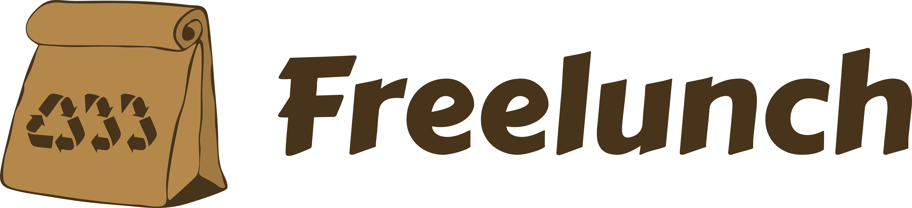

## About

Freelunch is an early-stage startup making declarative MLOps tools. Our goal is to make
make ML work as expected in production.

## Products

We currently make 2 products:

- __Freelunch Open Source:__ it's Backstage for MLOps. Open source tool for fabrication and improvement of ML Platforms.

    Instead of reinventing the wheel, it is designed to leverage existing best-in-class (open-source and proprietary) tools; without being tied to any specific tool (tool-agnostic).

    Note: __not an ML Platform__ (like *MLFlow* or *Kubeflow*); allows you to make your own internal ML Platform.

- __Freelunch Copilot:__ SaaS ML Engineering co-pilot that works on top of Freelunch Open Source. 

    It works with the ML team just like it was another human ML Engineer (e.g., makes PRs, interacts with team members via slack, builds datasets & models, operates the system, etc).

## Docs

You can checkout our docs in this repository to understand better our vision for the evolution of MLOps.

- Checkout our [Design Partnership Proposal Slides](https://docs.google.com/presentation/d/1kF-ZzVD8EiNLHFMuztEcYeT-kez1266R/edit?usp=sharing&ouid=114266237528985699122&rtpof=true&sd=true) for a concise and visual explanation.
- Checkout our [Design Notes](design_notes.md) for an in-depth explanation of not only Freelunch, but also of ML in production (including LLMs).

